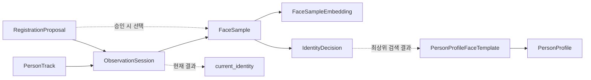
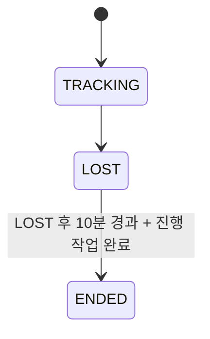

# 도메인 설계

## 핵심 개념

| 개념 | 책임 |
| --- | --- |
| `PersonTrack` | 현재 영상 속 한 사람의 추적 생명주기 |
| `ObservationSession` | 한 `PersonTrack`의 연속된 관찰 기간 |
| `FaceSample` | 품질·중복 평가를 통과해 저장·신원 판단에 사용하는 얼굴 표본 |
| `FaceSampleEmbedding` | FaceSample이 소유하는 임베딩 값. 독립 생명주기를 갖지 않는다. |
| `IdentityDecision` | 한 `FaceSample`에 대한 개별 신원 판단 기록 |
| `ObservationSession.current_identity` | 현재 관찰 대상의 최신 정체성 결과를 빠르게 조회하기 위한 속성 |
| `PersonProfile` | 시스템이 알고 있는 등록 인물 |
| `PersonProfileFaceTemplate` | 등록 인물의 얼굴 임베딩 표본 |
| `RegistrationProposal` | 외부인으로 확정된 관찰에 대한 등록 응답과 만료를 관리 |

`PersonTrack`은 카메라 속 대상이고 `PersonProfile`은 등록 인물이다. 둘은
같은 개념이 아니며, 추적이 시작될 때 그 대상의 신원은 알 수 없다.

## 도메인 관계와 불변 규칙



- `PersonTrack` 하나에는 하나의 `ObservationSession`만 연결한다. Track이 끝나면
  세션도 끝나며, 재등장한 사람은 새 Track과 새 세션으로 시작한다.
- `ObservationSession`은 그 관찰 중 생성된 FaceSample과 IdentityDecision의 맥락을
  보관한다. 현재 정체성은 세션의 속성으로만 둔다.
- 얼굴 검출 컴포넌트가 만든 `FaceCandidate`는 메모리에서 품질과 중복 평가를 거친다.
  두 기준을 통과한 후보만 FaceSample으로 생성·영속 저장하고 신원 판단으로 보낸다.
  FaceSample은 하나의 `FaceSampleEmbedding`과 최대 하나의 `IdentityDecision`을 가진다.
- 현재 정체성이 `ANALYZING`일 때만 새 FaceSample을 생성한다. `IDENTIFIED` 또는
  `EXTERNAL`로 결론이 나면 해당 ObservationSession에서는 이후 FaceCandidate를
  FaceSample로 저장하거나 IdentityDecision으로 판단하지 않는다.
- `IdentityDecision`은 그 표본의 최상위 검색 결과를 참조한다. 활성 템플릿이 없어
  검색 후보 자체가 없을 때만 PersonProfile과 템플릿 참조는 비어 있을 수 있다. 생성된
  결정은 수정하지 않는다.
- `PersonProfileFaceTemplate`은 정확히 하나의 PersonProfile에 속한다. 저장된 템플릿은
  신원 검색 대상이며, 프로필 삭제 시 함께 물리 삭제된다.
- `RegistrationProposal`은 하나의 ObservationSession에 대해 최대 한 번만 만들며,
  승인된 경우에만 해당 세션의 FaceSample을 골라 새 PersonProfile의 템플릿으로 연결한다.
- DB는 외래 키로 도메인 관계를 강제하지 않는다. Application Service와 Repository는 저장 전에
  세션·표본·판단·프로필·템플릿의 존재와 소유 관계를 검증한다.

## 데이터 보존 원칙

이 시스템은 얼굴 검출 직후 FaceCandidate를 메모리에서 만들고, 등록 인물 식별과 관찰
이력·재분석에 실제 사용한 고품질·비중복 후보만 FaceSample으로 영속화한다. 전체 카메라
원본 프레임은 저장하지 않고, 통과한 표본의 얼굴 crop과 임베딩만 저장한다.

| 데이터 | 기본 보존 위치 | 보존 원칙 |
| --- | --- | --- |
| 카메라 `Frame` | 메모리 | 표시·분석 후 즉시 사용 종료, 파일 저장 안 함 |
| 품질 미통과 얼굴 crop | 메모리 | 즉시 폐기 |
| 품질 통과·비중복 얼굴 crop | 영속 저장 | 전체 프레임 대신 실제 분석에 사용한 얼굴 영역만 영속 FaceSample에 연결해 저장 |
| FaceCandidate와 임시 임베딩 | 메모리 | 품질 미통과 또는 중복이면 즉시 폐기 |
| `FaceSample` | 영속 저장 | 통과한 표본의 촬영 시각·얼굴 crop·품질·자세 이력 보존 |
| `FaceSampleEmbedding` | FaceSample과 함께 영속 저장 | 모델 버전과 함께 저장, 재분석·등록 템플릿의 원본 |
| `ObservationSession` | 영속 저장 | FaceSample과 IdentityDecision의 관찰 맥락 보존 |
| `IdentityDecision` | 영속 저장 | 어떤 표본이 어떤 판단에 이르렀는지 이력 보존 |
| `RegistrationProposal` | 단기 영속 저장 | 응답·만료 후 상태 보존 범위는 추후 결정, 응답 가능 기간 최대 30분 |
| `PersonProfile` | 영속 저장 | 삭제 요청 전까지 보존 |
| `PersonProfileFaceTemplate` | 영속 저장·벡터 검색 대상 | 저장된 FaceSampleEmbedding을 등록 템플릿으로 연결 |

Telegram 운영 채널은 현재 범위에서 제외한다. 향후 도입해도 얼굴 이미지나
임베딩을 전송하지 않는 것을 기본값으로 하며, 전송 요구가 생기면 별도의 외부
제공·보안 설계를 추가한다.

## 추적과 관찰 생명주기



`PersonTrack`이 `LOST`여도 `ObservationSession`은 종료하지 않는다. `LOST`가 된
뒤에도 이미 시작된 얼굴 분석, 인물 확인, 저장 작업은 마무리한다. `LOST` 이후
10분이 지나고 진행 중인 작업도 모두 끝났을 때만 `PersonTrack`과
`ObservationSession`을 종료한다.

화면에 다시 나타난 사람은 새 `PersonTrack`으로 시작한다. 과거 `PersonTrack`을
복구하거나 장기 재식별하지 않는다. 새 추적도 같은 얼굴 분석과 등록 인물 검색을
독립적으로 수행한다.

## 신원 판단

`IdentityDecisionService`는 `FaceSample` 하나의 임베딩 검색 결과에서 유사도가 가장
높은 활성 `PersonProfileFaceTemplate` 하나를 선택해 `IdentityDecision`을 만든다.
유사도가 낮더라도 최상위 결과는 이력에 보존한다. 활성 템플릿이 전혀 없어 검색 결과가
없을 때만 PersonProfile과 템플릿 참조를 비워 둔다. `IdentityDecision`은 FaceSample 하나에
대한 개별 판단 이력이며, 보존 뒤 수정하지 않는다.

`IdentityPolicy`는 ObservationSession에 누적된 IdentityDecision을 PersonProfile별로
평가한다. 하나의 우연히 높은 유사도가, 일관되게 같은 PersonProfile을 가리킨 여러
표본보다 우선하지 않도록 하기 위해서다. 이 정책은 상태를 보관하지 않는다. 계산 결과는
`ObservationSession.current_identity` 속성에 반영한다.

검색 결과와 등록 인물 근거는 다르다. `IdentityDecision`은 유사도가 낮아도 표본별 최상위
후보와 유사도를 이력으로 남긴다. `IdentityPolicy`는 그 유사도가 등록 인물 인정 임계값 이상인
결정만 해당 PersonProfile의 근거로 계산한다. 후보가 없거나 유사도가 임계값 미만인 결정은
이력에는 남지만 등록 인물 근거가 아니다.

현재 정체성 결과는 다음 셋 중 하나다.

- `ANALYZING`: 아직 지인 또는 외부인 결론을 내릴 충분한 표본이 없음
- `IDENTIFIED`: 같은 PersonProfile의 등록 인물 근거가 비중복 FaceSample 2개 이상에서
  확인됨
- `EXTERNAL`: 등록 인물 근거가 없는 비중복 FaceSample이 3개 이상임

`IDENTIFIED`와 `EXTERNAL`은 해당 ObservationSession의 최종 정체성 결과다. 둘 중 하나가
결정되면 FaceSample 수집을 중단한다. 이미 분석 큐에 있던 FaceCandidate 결과가 뒤늦게
돌아와도 새 FaceSample이나 IdentityDecision으로 저장하지 않고 폐기한다.

`current_identity`는 독립 Entity가 아니다. 화면 표시와 현재 PersonProfile 접근을
빠르게 하기 위한 ObservationSession의 현재 결과 속성이다. 이 속성은 최소한
`status`, `person_profile_id`(식별된 경우), `identity_decision_id`(현재 결과의 근거가 된
최강 개별 결정)를 가진다. 따라서 화면의 현재 결과에서 해당 결정과 그 결정의 FaceSample까지
추적할 수 있다.

`current_identity.status`가 `IDENTIFIED`일 때만 `person_profile_id`가 존재한다.
`identity_decision_id`는 현재 결과를 뒷받침하는 결정 하나를 가리키며, 그 결정은 반드시
같은 ObservationSession의 FaceSample에서 만들어진 것이어야 한다. `IDENTIFIED`에서는
해당 PersonProfile을 지지한 결정 중 유사도가 가장 높은 것을 가리킨다.

## PersonProfile 결정

- 입력받는 인물 정보는 `name`이다.
- 동명이인은 허용한다. 시스템의 기준 식별자는 `PersonProfileId`다.
- 하나의 프로필에는 여러 얼굴 템플릿을 계속 추가할 수 있다.
- 삭제는 복구 없이 PersonProfile과 그 템플릿을 물리적으로 제거한다.
- 삭제된 프로필은 이후 검색 대상에 존재하지 않는다.
- 프로필을 참조하는 과거 `IdentityDecision`과 현재 신원 결과의 처리 규칙은 삭제 API를
  구현하기 전에 별도로 확정한다.

고품질·비중복 FaceSample은 등록 전에도 저장한다. 등록을 승인하면 해당 세션의 선별된
FaceSample을 `PersonProfileFaceTemplate`으로 연결한다. 템플릿의 임베딩은 원본
FaceSampleEmbedding을 다시 계산하지 않고 사용하며, `source_face_sample_id`로 출처를
추적한다. 현재 신원 검색 인덱스에는 PersonProfileFaceTemplate만 넣고, 일반
FaceSampleEmbedding은 이력·재분석 용도로만 보관한다.

하나의 FaceSample은 하나의 PersonProfileFaceTemplate에만 연결할 수 있다. 템플릿 추가는
외부인 등록 승인 처리에서만 발생하며, 프로필을 선택해 수동으로 추가하는 운영 흐름은 없다.

삭제 대상의 얼굴 템플릿과 프로필 정보는 삭제 처리와 함께 물리적으로 파기한다. 보유 목적이
끝난 개인정보의 파기 범위는 실제 운영 전 법적 보존 정책과 함께 확정한다.

## 개념적 타입

다음은 DB 모델이나 ORM이 아닌 계약용 타입이다. 시간은 UTC 기준이다.

```python
from dataclasses import dataclass
from datetime import datetime
from enum import Enum
from typing import Mapping, NewType, Sequence
from uuid import UUID

PersonProfileId = NewType("PersonProfileId", UUID)
PersonProfileFaceTemplateId = NewType("PersonProfileFaceTemplateId", UUID)
PersonTrackId = NewType("PersonTrackId", UUID)
ObservationSessionId = NewType("ObservationSessionId", UUID)
FaceSampleId = NewType("FaceSampleId", UUID)
IdentityDecisionId = NewType("IdentityDecisionId", UUID)
RegistrationProposalId = NewType("RegistrationProposalId", UUID)
FaceCropStorageKey = NewType("FaceCropStorageKey", str)
EmbeddingVector = Sequence[float]


@dataclass
class PersonProfile:
    id: PersonProfileId
    name: str
    created_at: datetime
    updated_at: datetime

    @classmethod
    def create(
        cls,
        command: "CreatePersonProfile",
    ) -> "PersonProfile": ...

    def add_face_template(
        self,
        source_face_sample: "FaceSample",
        added_at: datetime,
    ) -> "PersonProfileFaceTemplate": ...

@dataclass
class PersonProfileFaceTemplate:
    id: PersonProfileFaceTemplateId
    person_profile_id: PersonProfileId
    source_face_sample_id: FaceSampleId
    embedding_vector: EmbeddingVector
    embedding_model_version: str
    enrolled_at: datetime


@dataclass(frozen=True)
class CreatePersonProfile:
    name: str
    created_at: datetime


@dataclass(frozen=True)
class FaceTemplateSearchQuery:
    embedding_vector: EmbeddingVector
    embedding_model_version: str
    limit: int


@dataclass(frozen=True)
class PersonProfileCandidate:
    person_profile_id: PersonProfileId
    person_profile_face_template_id: PersonProfileFaceTemplateId
    similarity: float


@dataclass(frozen=True)
class FacePose:
    yaw_degrees: float
    pitch_degrees: float
    roll_degrees: float


@dataclass(frozen=True)
class FaceQualitySummary:
    score: float
    metrics: Mapping[str, float]


@dataclass(frozen=True)
class FaceSampleEmbedding:
    vector: EmbeddingVector
    model_version: str
    created_at: datetime


@dataclass(frozen=True)
class CreateFaceSample:
    observation_session_id: ObservationSessionId
    captured_at: datetime
    face_crop_storage_key: FaceCropStorageKey
    quality: FaceQualitySummary
    pose: FacePose
    embedding: FaceSampleEmbedding
    created_at: datetime


@dataclass(frozen=True)
class FaceSample:
    id: FaceSampleId
    observation_session_id: ObservationSessionId
    captured_at: datetime
    face_crop_storage_key: FaceCropStorageKey
    quality: FaceQualitySummary
    pose: FacePose
    embedding: FaceSampleEmbedding
    created_at: datetime

    @classmethod
    def create(
        cls,
        command: CreateFaceSample,
    ) -> "FaceSample": ...


@dataclass(frozen=True)
class CreateIdentityDecision:
    face_sample_id: FaceSampleId
    search_candidates: Sequence[PersonProfileCandidate]
    decided_at: datetime


@dataclass(frozen=True)
class IdentityDecision:
    id: IdentityDecisionId
    face_sample_id: FaceSampleId
    candidate_person_profile_id: Optional[PersonProfileId]
    candidate_face_template_id: Optional[PersonProfileFaceTemplateId]
    similarity: Optional[float]
    decided_at: datetime


class CurrentIdentityStatus(str, Enum):
    ANALYZING = "ANALYZING"
    IDENTIFIED = "IDENTIFIED"
    EXTERNAL = "EXTERNAL"


@dataclass(frozen=True)
class EvaluateIdentity:
    observation_session_id: ObservationSessionId
    identity_decisions: Sequence[IdentityDecision]
    evaluated_at: datetime


@dataclass(frozen=True)
class CurrentIdentityResult:
    observation_session_id: ObservationSessionId
    status: CurrentIdentityStatus
    person_profile_id: Optional[PersonProfileId]
    identity_decision_id: Optional[IdentityDecisionId]
    evaluated_at: datetime
```

`FaceSample.create`는 FaceCandidate가 품질·중복 평가를 통과했고, crop이 객체 저장소에
성공적으로 기록된 뒤에만 호출한다. 이 메서드는 평가·중복 판정·파일 업로드를 수행하지
않고, 이미 검증된 기술 결과를 불변 도메인 기록으로 전환한다.

`captured_at`은 카메라에서 표본을 얻은 시각이고 `created_at`은 FaceSample 기록을 만든
시각이다. 분석 대기열 때문에 두 시각은 다를 수 있다. `FaceQualitySummary.metrics`는
평가기가 제공한 세부 점수를 보존하기 위한 값이며, 개별 항목과 통과 임계값은 품질 정책에서
결정한다.

`FaceSampleEmbedding`은 FaceSample에만 속하는 값 객체다. 독립 ID나 생성 메서드를 두지
않으며, FaceSample이 저장될 때 함께 저장하고 FaceSample이 없으면 보존하지 않는다.

`PersonProfile.create`는 빈 이름을 허용하지 않으며 동명이인은 막지 않는다.
`add_face_template`은 전달받은 FaceSample의
기존 임베딩을 사용해 템플릿을 만들며, 임베딩을 다시 계산하지 않는다. 동일 FaceSample의
중복 연결 확인은 다른 템플릿 이력을 조회해야 하므로 Application과 Repository가 수행한다.

`CreateIdentityDecision.search_candidates`는 기술 검색 결과이며, 생성된
`IdentityDecision`에는 그중 유사도가 가장 높은 한 건만 남는다. 후보가 비어 있으면 세
후보 관련 값은 모두 `None`이다.

최상위 검색 결과의 동점은 벡터 검색 컴포넌트가 유사도 내림차순 뒤 템플릿 ID 오름차순으로
정렬해 재현 가능하게 선택한다. 이는 단일 표본의 기술적 대표 결과일 뿐 신원 확정 근거가
아니다. 신원 확정은 등록 인물 인정 임계값을 넘는 서로 다른 FaceSample 2개의 누적으로만
이뤄진다.

`CurrentIdentityResult`는 독립 Entity가 아니라 `ObservationSession.current_identity`에
반영할 값 객체다. `IDENTIFIED` 결과는 `person_profile_id`와 `identity_decision_id`를 반드시
가져야 하며, 그 결정의 후보 프로필은 같은 `person_profile_id`여야 한다. 다른 상태에서는
두 참조가 없을 수 있다.

## PersonTrack 개념적 메서드

`PersonTrack`은 추적 컴포넌트의 내부 track ID, bounding box, 프레임별 갱신값을 갖지
않는다. 컴포넌트는 그 기술 정보를 사용해 추적 시작·상실 이벤트를 만들고, Application이
확정된 이벤트만 PersonTrack에 전달한다. PersonTrack의 책임은 한 관찰 대상의 생명주기다.

추적 컴포넌트 안에서는 검출된 사람을 내부 ID로 연결하고, 같은 ID가 연속 확인 프레임 수를
채웠을 때만 `TRACK_CONFIRMED` 이벤트를 만든다. 초기 확인 프레임 수는 3이며 설정값이다.
일시 가림은 추적기의 상실 허용 구간 안에서 내부적으로 처리한다. 이 구간을 넘겨 내부 ID가
종료됐을 때만 `TRACK_LOST` 이벤트를 만든다. 후보와 내부 ID는 기술 상태일 뿐 Domain 객체가
아니다.

```python
class PersonTrackStatus(str, Enum):
    TRACKING = "TRACKING"
    LOST = "LOST"
    ENDED = "ENDED"


@dataclass
class PersonTrack:
    id: PersonTrackId
    started_at: datetime
    status: PersonTrackStatus
    lost_at: Optional[datetime]
    ended_at: Optional[datetime]

    @classmethod
    def start(
        cls,
        started_at: datetime,
    ) -> "PersonTrack": ...

    def mark_lost(
        self,
        lost_at: datetime,
    ) -> None: ...

    def can_end(
        self,
        evaluated_at: datetime,
    ) -> bool: ...

    def end(
        self,
        ended_at: datetime,
    ) -> None: ...
```

- `start`는 `TRACK_CONFIRMED` 결과에 대해서만 호출한다. 시작 시각은 대상 검출 시각이
  아니라, 같은 대상을 연속 확인해 Track으로 확정한 시각이다.
- `mark_lost`는 `TRACK_LOST` 이벤트가 전달됐을 때 호출한다.
  `LOST`는 화면 표시는 멈추지만 이미 시작한 분석·저장 작업은 계속 마무리할 수 있는 상태다.
- `can_end`는 `LOST` 뒤 10분이 지났는지만 판단한다. 호출 시각을 받는 이유는 종료 점검이
  지연되거나 재시도되어도 같은 관찰 시각을 기준으로 판단하기 위해서다.
- `end`는 `can_end`가 참인 Track만 종료한다. 진행 중인 작업이 모두 끝났는지 확인하는 것은
  Application의 책임이며, 그 조건이 만족됐을 때만 `end`를 호출한다.
- `LOST` Track은 다시 `TRACKING`으로 되돌아가지 않는다. 이후 다시 보이는 사람은 새
  PersonTrack으로 시작한다.

## ObservationSession 개념적 메서드

`ObservationSession`은 관찰 단위의 생명주기와 현재 정체성만 관리한다. FaceSample과
IdentityDecision은 각각 세션 ID 또는 FaceSample ID로 연결되는 불변 이력이다. 따라서
고빈도 표본을 세션 내부 컬렉션으로 매번 불러와 수정하지 않는다.

```python
class ObservationSessionStatus(str, Enum):
    ACTIVE = "ACTIVE"
    ENDED = "ENDED"


@dataclass
class ObservationSession:
    id: ObservationSessionId
    person_track_id: PersonTrackId
    started_at: datetime
    status: ObservationSessionStatus
    ended_at: Optional[datetime]
    current_identity: CurrentIdentityResult

    @classmethod
    def start(
        cls,
        person_track_id: PersonTrackId,
        started_at: datetime,
    ) -> "ObservationSession": ...

    def update_current_identity(
        self,
        result: CurrentIdentityResult,
    ) -> None: ...

    def end(
        self,
        ended_at: datetime,
    ) -> None: ...
```

- `start`는 `ACTIVE` 세션과 `ANALYZING` 초기 현재 정체성을 만든다. PersonTrack 하나에
  대해 세션은 한 번만 시작한다.
- `update_current_identity`는 활성 세션에서만 호출할 수 있다. 입력 결과의
  `observation_session_id`는 자신의 ID와 같아야 하며, 과거 비동기 작업 결과가 최신 결과를
  덮어쓰지 않도록 `evaluated_at`은 현재 값보다 같거나 늦어야 한다.
- `end`는 활성 세션만 종료할 수 있고, `ended_at`은 `started_at`보다 빠를 수 없다. 진행 중인
  분석·저장 작업이 모두 끝났는지 확인하는 책임은 런타임 작업을 아는 Application에 있다.
- 종료된 세션은 새 FaceSample, IdentityDecision, 현재 정체성 결과를 받지 않는다.

## 개념적 계약

`PersonProfileRepository`는 프로필과 템플릿의 영속 상태를 저장·조회한다. Domain 객체의
생성·상태 전환 규칙을 대신 수행하지 않는다. `find_active_...`의 `None`은 활성 레코드가
없거나 이미 삭제됐음을 뜻한다.

```python
from datetime import datetime
from typing import Optional, Protocol, Sequence


class PersonProfileRepository(Protocol):
    def save_profile(
        self,
        profile: PersonProfile,
    ) -> PersonProfile: ...

    def find_active_profile_by_id(
        self,
        person_profile_id: PersonProfileId,
    ) -> Optional[PersonProfile]: ...

    def find_active_profiles_by_ids(
        self,
        person_profile_ids: Sequence[PersonProfileId],
    ) -> Sequence[PersonProfile]: ...

    def save_face_template(
        self,
        face_template: PersonProfileFaceTemplate,
    ) -> PersonProfileFaceTemplate: ...

    def find_active_face_templates(
        self,
        person_profile_id: PersonProfileId,
    ) -> Sequence[PersonProfileFaceTemplate]: ...

    def find_face_template_by_source_face_sample_id(
        self,
        source_face_sample_id: FaceSampleId,
    ) -> Optional[PersonProfileFaceTemplate]: ...

class VectorSearchComponent(Protocol):
    def search_person_profile_candidates(
        self,
        query: FaceTemplateSearchQuery,
    ) -> Sequence[PersonProfileCandidate]: ...


class IdentityDecisionService(Protocol):
    def decide(
        self,
        command: CreateIdentityDecision,
    ) -> IdentityDecision: ...


class IdentityPolicy(Protocol):
    def evaluate(
        self,
        command: EvaluateIdentity,
    ) -> CurrentIdentityResult: ...
```

프로필 삭제는 해당 프로필의 모든 템플릿을 검색 불가 상태로 만든다. 벡터 검색은 활성
프로필과 활성 템플릿만 대상으로 제한한다. `find_face_template_by_source_face_sample_id`는
삭제 여부와 관계없이 기존 연결을 찾아 FaceSample의 재사용을 막는다. 구현의 트랜잭션
방식은 DB 설계 단계에서 결정한다.

`IdentityDecisionService.decide`와 `IdentityPolicy.evaluate`는 영속 저장이나
`ObservationSession` 변경을 직접 수행하지 않는다. Application이 반환값을 저장하고,
이후 ObservationSession이 같은 세션의 `CurrentIdentityResult`만 반영한다.

## 얼굴 적합도와 얼굴 매칭

1. 얼굴 검출 결과로 메모리상 `FaceCandidate`를 만든다.
2. `FaceQualityEvaluationComponent`가 흐림, 밝기, 얼굴 크기, 자세 등 기술적 품질을
   평가한다.
3. 품질을 통과한 FaceCandidate만 `FaceEmbeddingComponent`로 임베딩을 만든다.
4. 현재 ObservationSession의 기존 영속 FaceSample 임베딩과 비교해 중복이면 FaceCandidate와
   임베딩을 폐기한다.
5. 비중복 FaceCandidate와 임베딩으로 FaceSample을 생성·영속 저장한다.
6. `VectorSearchComponent`가 활성 템플릿과 비교해 후보와 유사도를 반환한다.
7. `IdentityDecisionService`가 표본별 최상위 검색 결과로 `IdentityDecision`을 만든다.
8. `IdentityPolicy`가 세션에 누적된 결정을 평가해 현재 정체성 결과를 계산한다.

중복 판정은 같은 ObservationSession의 기존 FaceSample만 대상으로 한다. 다른 세션의
표본과 비교해 새 관찰을 과거 관찰에 연결하지 않는다.

품질은 프레임을 사용할 수 있는지, 유사도는 두 얼굴 벡터가 얼마나 가까운지를
뜻한다. 둘 중 어느 하나도 단독으로 신원 확정을 의미하지 않는다.

## 등록 제안

`EXTERNAL`은 충분한 고품질·비중복 표본을 확인했지만 현재 등록 인물로 확정되지
않았다는 현재 결과다. 이 상태가 되기 전에는 등록을 묻지 않는다. 하나의
`ObservationSession`에서 외부인 결과가 확정됐을 때만 등록 제안을 만들 수 있다.

등록 제안은 프로필이나 얼굴 템플릿이 아니다. 등록 여부를 운영자에게 묻기 위한
일시적 업무 객체이며, 같은 ObservationSession에는 한 번만 생성한다.

등록 제안은 `EXTERNAL`을 확정하는 데 사용돼 이미 저장된 FaceSample만 선택한다. 외부인
확정 뒤에는 FaceSample을 더 만들지 않으므로, 선택 가능한 표본이 등록 정책의 최소 수와
자세 다양성을 충족할 때만 제안을 생성한다. 충족하지 못하면 해당 ObservationSession에서는
등록을 묻지 않는다.

```python
from dataclasses import dataclass
from datetime import datetime
from enum import Enum
from typing import Optional, Sequence


class RegistrationResponseType(str, Enum):
    ACCEPT = "ACCEPT"
    REJECT = "REJECT"


class RegistrationProposalStatus(str, Enum):
    PENDING = "PENDING"
    ACCEPTED = "ACCEPTED"
    REJECTED = "REJECTED"
    EXPIRED = "EXPIRED"


@dataclass
class RegistrationProposal:
    id: RegistrationProposalId
    observation_session_id: ObservationSessionId
    face_sample_ids: Sequence[FaceSampleId]
    created_at: datetime
    expires_at: datetime
    status: RegistrationProposalStatus
    accepted_name: Optional[str]
    responded_at: Optional[datetime]

    @classmethod
    def create(
        cls,
        observation_session_id: ObservationSessionId,
        face_sample_ids: Sequence[FaceSampleId],
        created_at: datetime,
    ) -> "RegistrationProposal": ...

    def accept(
        self,
        name: str,
        responded_at: datetime,
    ) -> None: ...

    def reject(
        self,
        responded_at: datetime,
    ) -> None: ...

    def expire(
        self,
        expired_at: datetime,
    ) -> None: ...


@dataclass(frozen=True)
class RegistrationResponse:
    proposal_id: RegistrationProposalId
    response_type: RegistrationResponseType
    name: Optional[str]
    responded_at: datetime
```

`ACCEPT`에는 빈 값이 아닌 `name`이 필수다. `REJECT`에는 이름을 받지 않는다.
`create`는 만료 시각을 생성 시각부터 30분 뒤로 정한다. `accept`와 `reject`는 `PENDING`
상태이면서 `responded_at`이 만료 시각을 넘지 않을 때만 호출할 수 있다. `expire`는
`PENDING` 상태이고 만료 시각 이후일 때만 호출한다. 종료 상태에서는 응답을 바꾸거나 다시
제안할 수 없다.

제안 생성 전의 `EXTERNAL` 상태 확인, 같은 세션에 기존 제안이 없는지 확인, 선택된
FaceSample이 해당 세션의 영속 표본인지 확인은 다른 이력을 조회해야 하므로 Application과
Repository의 책임이다. 충분한 표본 수와 자세 다양성 기준은 등록 정책에서 결정한다.

`ACCEPTED`는 운영자가 이름을 입력해 등록에 동의했다는 뜻일 뿐, 프로필 등록 성공을
뜻하지 않는다. Application이 이후 프로필 생성, 템플릿 연결, 검색 대상 반영을 수행하고
`REGISTERED` 또는 `FAILED` 결과를 별도로 남긴다.

등록 처리에서는 기존 FaceSampleEmbedding으로 PersonProfileFaceTemplate을 만들며, 얼굴
crop을 MinIO에 새로 저장하지 않는다. pgvector가 PostgreSQL 안에서 템플릿 검색을 제공하므로
프로필·템플릿·등록 처리 결과는 하나의 PostgreSQL 트랜잭션으로 함께 커밋한다.

등록 성공은 현재 `EXTERNAL` ObservationSession을 `IDENTIFIED`로 바꾸지 않는다.
IdentityDecision은 FaceSample당 하나의 불변 이력이며, 외부인 확정 뒤에는 새 표본과 새
결정을 만들지 않기 때문이다. 새 PersonProfile과 템플릿은 이후 새 ObservationSession의
검색 대상부터 사용한다.

## 등록 응답 채널 계약

등록 Application은 등록 제안을 발행하고 응답을 처리한다. 현재 구현 대상인
Terminal은 이 계약의 구현체일 뿐, 프로필 저장이나 얼굴 검색을 직접 수행하지
않는다. 향후 외부 채널도 같은 계약을 구현할 수 있다.

```python
from dataclasses import dataclass
from datetime import datetime
from enum import Enum
from typing import Optional, Protocol


class RegistrationHandlingStatus(str, Enum):
    REGISTERED = "REGISTERED"
    REJECTED = "REJECTED"
    FAILED = "FAILED"


@dataclass(frozen=True)
class RegistrationHandlingResult:
    proposal_id: RegistrationProposalId
    status: RegistrationHandlingStatus
    person_profile_id: Optional[PersonProfileId]
    completed_at: datetime
    failure_reason: Optional[str]


class RegistrationRequestChannel(Protocol):
    def publish(self, proposal: RegistrationProposal) -> None: ...


class RegistrationResponseHandler(Protocol):
    def handle(
        self,
        response: RegistrationResponse,
    ) -> RegistrationHandlingResult: ...
```

`publish`는 카메라·분석 작업자를 기다리게 하지 않는다. Terminal 채널은 별도
입력 작업에서 이름을 직접 받고 `RegistrationResponseHandler.handle`에 응답을
전달한다. 외부 채널은 후속 범위다.

등록 제안은 내부 업무 객체의 이름이다. 현재 Terminal은 이름을 한 번 입력받으며,
빈 입력은 거절로 처리한다. 제안은 생성 뒤 30분 동안만 `PENDING` 상태이며,
`ACCEPTED`, `REJECTED`, `EXPIRED` 중 하나가 되면 해당 ObservationSession에는 다시
질문하지 않는다.
