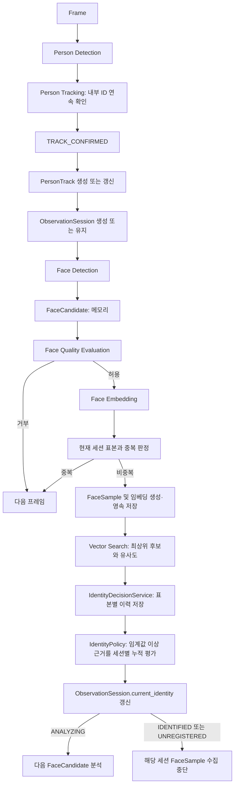
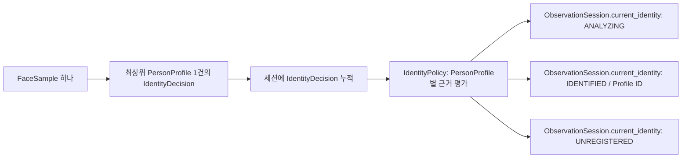
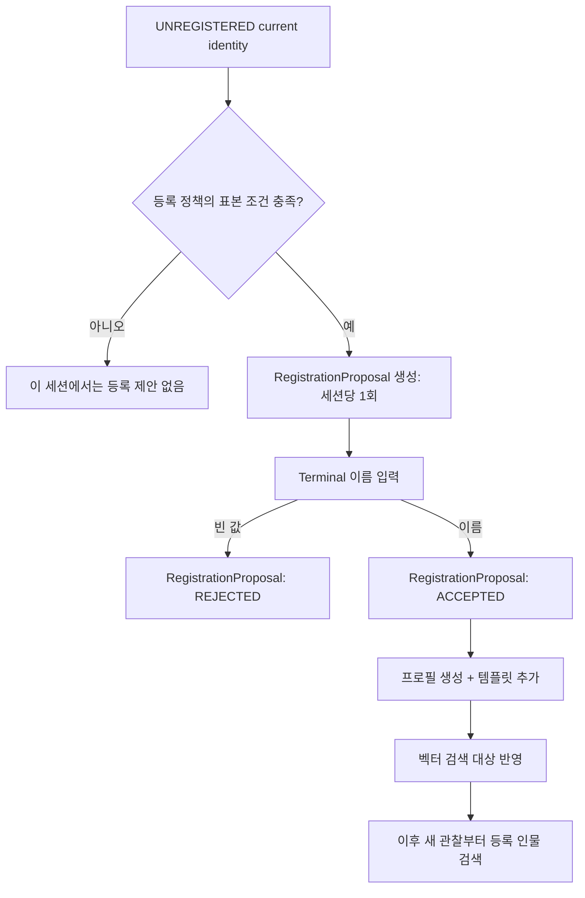

# 처리 흐름

## 실시간 분석 흐름

## 추적 상태별 처리

| 입력 상태 | Application 처리 | 관찰 세션 |
| --- | --- | --- |
| 새 `TRACK_CONFIRMED` | `PersonTrack` 생성 | 새 `ObservationSession` 생성 |
| 이미 연결된 내부 ID의 확인 결과 | 기존 Track 갱신 | 기존 세션 유지 |
| `TRACK_MISSING` | 화면 표시 제거, 30초 기술 Track 보존 및 기존 관찰 세션 LOST 기록 | 유지 |
| `TRACK_REAPPEARED` | 같은 기술 Track에 새 ObservationSession을 만들고 재검증 시작 | 새 세션 생성 |
| `TRACK_LOST` | 30초 내 재등장하지 않은 기술 Track 폐기 | 이미 LOST인 세션 이력 유지 |

화면에서 확정 Track은 `표본 수집 중 | T-XXXXXXXX`으로 표시한다. `T-` 코드는 현재 관찰
세션을 구별하는 임시 코드다. 최대 표본까지 등록 인물로 확인되지 않으면 `임시 인물 | U-XXXXXXXX`으로 바뀐다. `U-`
코드는 `RegistrationProposal` ID에서 만든 불변 임시 인물 코드이며, 화면과 터미널의 이름
입력 요청은 같은 코드를 사용한다. 등록 인물은 기본적으로 이름만 표시한다.

`RegistrationCoordinator`는 임시 인물 전환 완료 순서(FIFO)로 요청을 관리하고, 등록 채널에는
한 번에 하나의 활성 요청만 전달한다. 현재 요청의 Y/N과 이름 입력이 완료돼야 다음 요청을
묻는다. Telegram은 같은 `RegistrationChannel` 포트를 구현하는 추가 어댑터이며, 도메인 등록
규칙과 FIFO 순서는 바꾸지 않는다.
| LOST 후 10분 경과 + 진행 작업 완료 | Track 종료 | 세션 종료 |

추적 컴포넌트는 같은 내부 ID가 연속 확인 프레임 수를 채워야 `TRACK_CONFIRMED`를 낸다.
초기 확인 프레임 수는 3이다. 마지막 검출 뒤 1초 동안 다시 확인되지 않으면 `TRACK_MISSING`으로
화면 표시만 지우고 내부 ID를 30초 보관한다. 그 안에 IoU로 다시 연결되면 `TRACK_REAPPEARED`를
내며, 이전 이름은 `이름?`으로만 표시한다. 재등장자는 같은 기술 Track을 쓰되 새
ObservationSession에서 얼굴 표본을 다시 검증한다. 검증 전 이름은 확정 표시하지 않는다.

## 신원 상태 흐름

과거 `IdentityDecision`은 이력으로 남는다. 현재 결과는 독립 객체가 아니라
`ObservationSession.current_identity`에 보관한다.

최상위 검색 결과가 있다고 바로 등록 인물 근거가 되지는 않는다. `IdentityPolicy`가 유사도를
등록 인물 인정 임계값과 비교해 근거 여부를 정한다. 같은 PersonProfile의 근거가 서로 다른
FaceSample 2개에서 확인되면 `IDENTIFIED`, 고품질·비중복 FaceSample이 최대 5개까지도
등록 인물 근거를 만들지 못하면 `UNREGISTERED`이며, 그 전에는 `ANALYZING`이다.

## 로컬 운영 신원 판단

로컬 운영은 SQLite의 등록 템플릿 전체를 읽어 NumPy cosine similarity로
최상위 후보를 찾는다. 표본별 검색 결과는 `identity_decisions`에 저장하고,
`IdentityPolicy`가 같은 프로필의 인정 근거 두 개를 확인하면 `IDENTIFIED`로 확정한다.
등록 인물 근거가 없는 표본은 최대 5개까지 추가로 검증한 뒤 `UNREGISTERED`로 전환한다. 등록 인물 인정 임계값은
현재 초기값 `0.60`이며 실제 카메라 보정 대상이다.

## 임시 인물 등록 흐름

`UNREGISTERED`는 "외부인" 판정이 아니다. 충분한 고품질·비중복 표본을
확인했지만 현재 등록 프로필로 확인되지 않아 임시 코드로 관찰하는 상태다.
등록 제안은 이 결과가 확정된 뒤에만 가능하다.

이름 입력은 `RegistrationProposal`을 `ACCEPTED`로 전환할 뿐, 등록 성공을 뜻하지 않는다.
프로필 생성과 선택된 얼굴 임베딩의 템플릿 추가는 그 뒤 하나의 등록 작업으로 취급한다.
pgvector는 PostgreSQL 내부의 검색 인덱스이므로, PersonProfile·템플릿·등록 처리 결과를
하나의 PostgreSQL 트랜잭션으로 커밋한다. 등록 단계에서는 이미 저장된 FaceSample의
임베딩을 사용하므로 MinIO에 새 얼굴 crop을 저장하지 않는다.

품질과 비중복 기준을 통과한 얼굴 crop과 임베딩은 등록 여부와 관계없이 `FaceSample`
이력으로 저장한다. 중복 후보는 저장하거나 신원 판단에 사용하지 않는다. 이름 입력으로
등록이 완료되면 선별된 기존 임베딩이 `PersonProfileFaceTemplate`으로 연결된다.
빈 입력·만료·등록 실패는 프로필과 템플릿을
생성하지 않을 뿐, 수집된 고품질 표본 이력은 유지한다.

등록이 완료돼도 현재 ObservationSession의 `UNREGISTERED` 결과를 다시 `IDENTIFIED`로 바꾸지
않는다. FaceSample당 하나의 불변 IdentityDecision만 보존한다는 규칙과, `UNREGISTERED` 확정 뒤
FaceSample 수집을 끝낸다는 규칙을 지키기 위해서다. 이후 카메라에 새로 나타나 새
ObservationSession이 시작되면 등록된 템플릿을 검색 대상으로 사용한다.

### 로컬 운영 등록

로컬 운영은 SQLite 검색을 사용한다. `IDENTIFIED` 또는 `UNREGISTERED` 전에는
FaceSample 수를 최대 5개로 제한한다. `UNREGISTERED`가 다섯 번째 등록 인물 근거 없는
표본에서 확정되면 별도 Terminal 입력 작업자가 이름을 한 번 요청한다. 빈 입력은 취소이고,
Terminal에서 `Y`로 등록을 확인한 뒤 이름을 입력하면 임시 인물 판정에 사용된 FaceSample의 임베딩으로 SQLite PersonProfile과
템플릿을 만든다. 등록이 끝난 현재 Track의 카메라
표시는 입력한 이름으로 즉시 바뀐다. 이후 새 Track은 저장된 템플릿을 검색해 같은
프로필의 근거가 두 개 쌓이면 그 이름을 표시한다.

SQLite에서도 Terminal 입력 전에 `registration_proposals`의 `PENDING` 레코드를 먼저
만든다. 빈 입력은 `REJECTED`, 1시간 무응답은 `EXPIRED`, 이름 입력 뒤 프로필·템플릿 저장이
성공하면 `ACCEPTED`와 `REGISTERED` 처리 결과를 기록한다. 저장 오류는 `FAILED` 처리 결과로
보존한다.

## 프로세스 재시작 뒤의 처리

저장된 ObservationSession과 FaceSample, IdentityDecision은 과거 이력과
재분석에 사용한다. 프로세스가 종료되면 카메라의 PersonTrack은 이어지지 않으므로,
재시작 뒤 새 프레임에서는 새 Track과 새 ObservationSession을 만든다.

이미 등록된 인물은 저장된 PersonProfileFaceTemplate 검색으로 새 세션에서 다시
식별한다. 새로 나타난 사람은 새 PersonTrack과 새 ObservationSession으로
시작한다. 과거 FaceSample을 새 사람과 자동으로 같은 사람으로 묶거나, 과거
PersonTrack을 복구하는 기능은 현재 범위에 포함하지 않는다.

## 등록용 얼굴 표본 정책

등록 표본은 단순히 품질 점수가 높은 프레임 여러 장이 아니다. 같은 자세의
연속 프레임을 막기 위해 품질 조건과 다양성 조건을 모두 통과해야 한다.

### 품질 게이트

다음 항목을 개별적으로 확인한다.

- 얼굴 검출 신뢰도
- 얼굴 짧은 변 픽셀 크기: 현재 초기 기준 56px 이상
- 초점/흐림, 밝기
- 얼굴 좌우 방향: 눈·코 랜드마크로 계산한 yaw 근사값
- 얼굴 가림 여부

현재 로컬 운영 구현은 검출 신뢰도, 초점·흐림, 밝기, 크기와 68점 랜드마크 기반의
yaw·pitch·roll 값을 사용한다. 통과 하한은 검출 신뢰도 `0.375`, 선명도 `10`, 짧은 변
`56px`이며, 최대 절대 각도는 yaw `65도`, pitch `50도`, roll `40도`다. 가림 평가는
로컬 `face_occlusion.onnx`가 계산한 가림 확률이 `0.50` 이하일 때만 통과시킨다. 이 값은
맨얼굴·마스크·손 가림 실제 카메라 표본으로 보정해야 하는 초기값이다.

자세값은 FaceSample 메타데이터와 로그에 기록하며, 위 초기 범위를 벗어나면 표본을 거부한다.

`UNREGISTERED` 확정 뒤에는 FaceSample을 추가로 수집하지 않는다. 등록 제안은 임시 인물 판정에
실제로 사용된 최대 다섯 FaceSample을 참조하며, 이름 입력 뒤 그 임베딩을 새 PersonProfile의
템플릿으로 연결한다. 등록을 위한 별도 자세·방향 조건이나 표본 재선별은 두지 않는다.

### 중복 판정

중복 판정은 등록 직전의 후보 선별이 아니라 FaceSample 생성 전 수행한다. 품질을 통과한
임시 얼굴 후보는 현재 ObservationSession의 표본과 비교한다. 기존 표본과 yaw·pitch·roll
차이가 각각 `15도` 이하면 같은 자세의 표본으로 폐기한다. 자세와 무관하게 최고 cosine
similarity가 `0.98` 이상이면 거의 동일한 얼굴 데이터로 폐기한다. 이 경우 crop, 임베딩,
FaceSample, IdentityDecision 어느 것도 영속 저장하지 않는다.

정규화된 임베딩을 사용하는 모델이라면 NumPy 내적으로 cosine similarity를 계산할 수
있다. 중복 기준과 자세 범위, 크기·흐림 기준은 실제 카메라 표본으로 보정하는 설정값이며,
아직 확정값으로 고정하지 않는다.
