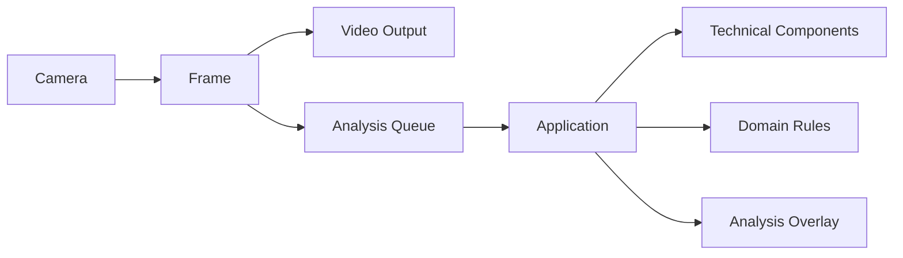
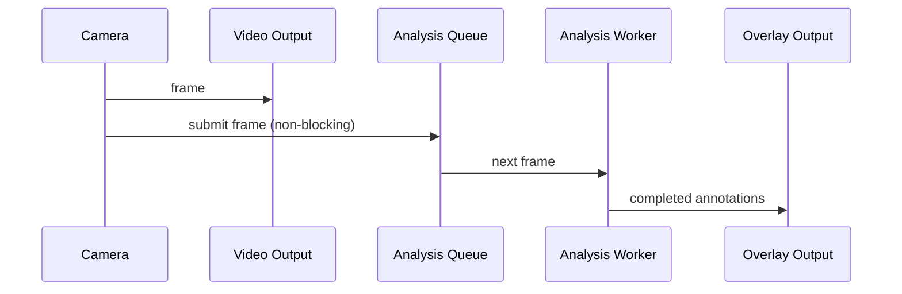
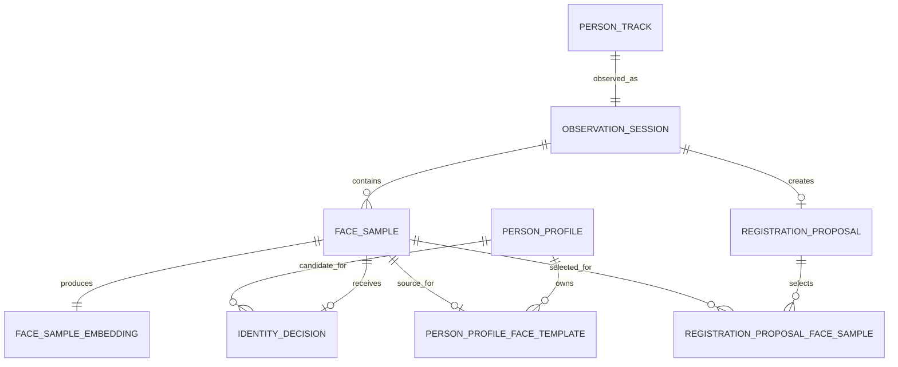

# 시스템 설계

## 목적과 범위

이 시스템은 실시간 카메라 영상에서 사람을 검출·추적하고, 얼굴을 분석하여
등록 인물과의 일치 여부를 판단한다. 영상 표시는 AI 분석 결과를 기다리지
않으며, 분석 결과는 별도의 오버레이 화면과 로그로 전달한다.

카메라 프레임, 얼굴 crop, 임베딩, 신원 검색과 SQLite 데이터는 모두 실행 PC에서만 처리한다.
모델은 로컬 가중치를 ONNX Runtime CPU로 실행하며, 실행 경로에는 외부 API·클라우드 추론·원격
저장소로 얼굴 정보를 보내는 단계가 없다.

현재 범위는 카메라 입력, 사람 검출·추적, 얼굴 검출·품질 평가·임베딩,
신원 판단과 Terminal 기반 등록 업무 흐름이다. Telegram 등 외부 알림 채널은
후속 범위다.

## 도메인 책임 경계

`camera_streamer/domain/`은 업무 상태 전이와 불변 규칙만 소유한다.
`PersonTrack`은 추적 생명주기, `ObservationSession`은 현재 신원과 세션 종료,
`FaceSample`과 `IdentityDecision`은 불변 이력 생성, `IdentityPolicy`는 누적 판단,
`RegistrationProposal`은 응답·만료 전이를 맡는다. Application Service는 도메인 객체의
생성·전이·저장 순서를 조율하고, Infrastructure의 Repository는 이를 저장·조회한다.
`VisionApplication`은 카메라·작업 큐·화면 표시와 사용자 입력 채널만 조율한다.

## 논리 구조

### Domain

현실의 개념과 규칙을 표현한다. AI 모델, 카메라, DB 라이브러리에 의존하지
않는다. 주요 개념은 `PersonTrack`, `ObservationSession`, `FaceSample`,
`IdentityDecision`이며, 현재 정체성 결과는 `ObservationSession`의 속성으로
보관한다.

### Application

프레임 처리의 순서를 조율하고 Component 결과를 Domain 객체와 연결한다.
Application은 신원 판단 규칙이나 AI 알고리즘을 직접 갖지 않는다.

### Components

검출, 추적, 얼굴 분석, 품질 평가와 표본 중복 판정 같은 기술 능력을
제공한다. Component는 "무엇을 감지·계산했는가"를 반환하며,
"누구인가"를 판단하지 않는다.

`infrastructure/`에는 로컬 SQLite 또는 PostgreSQL·pgvector·MinIO Repository처럼
실제 저장 기술과 연결되는 구현을 둔다. Domain은 이 구체
기술에 직접 의존하지 않는다.

사람 추적기는 검출 결과를 내부 ID로 연결한다. 같은 내부 ID가 연속 확인 프레임 수를
채우면 `TRACK_CONFIRMED`, 상실 허용 구간을 넘겨 내부 ID가 종료되면 `TRACK_LOST`를
Application에 전달한다. 초기 확인 프레임 수는 3이며, 두 기준은 런타임 설정값이다.
Domain에는 이 확정·상실 이벤트만 전달하고 내부 ID·bounding box·프레임 카운터는 저장하지
않는다.

## 실시간 실행 구조

카메라 프레임은 즉시 영상 출력으로 전달된다. 같은 프레임은 제한된 큐를 통해
비동기 분석 작업자에게 제출된다. 분석이 느려 큐가 가득 차면 분석용 프레임을
버릴 수 있지만, 영상 출력은 기다리지 않는다.

## 현재 기술 스택

| 책임 | 현재 기술 |
| --- | --- |
| 구현 언어 | Python 3.9 이상 |
| 카메라·영상 표시 | OpenCV |
| 사람 검출 | Ultralytics YOLO, 로컬 가중치 |
| 사람 추적 | IoU 기반 추적기 |
| 얼굴 검출·임베딩 | InsightFace, ONNX Runtime CPU |
| 얼굴 품질 | OpenCV 촬영 품질 지표 + 로컬 ONNX 가림 분류기 |
| 기준 DB·벡터 검색 | 자체 운영 PostgreSQL + pgvector |
| 얼굴 crop 저장소 | 자체 운영 MinIO, S3 호환 API |

클라우드 서비스와 전용 벡터 DB는 사용하지 않는다. pgvector는 PostgreSQL 안에서
동작하므로, 프로필·세션·표본·판단·벡터를 하나의 DB 트랜잭션 경계에서 관리한다.

## 논리 DB 스키마

이 스키마는 현재 도메인 설계를 반영한 논리 데이터 관계다. 대규모 운영은 자체 운영
PostgreSQL과 pgvector, 얼굴 crop용 자체 운영 MinIO를 사용한다. 로컬 운영은 동일한
논리 관계를 SQLite와 private 로컬 파일 저장으로 구현한다. 둘은 같은 도메인·유스케이스를
수행하는 운영 모드이며, 저장·검색 어댑터만 다르다.

### `person_profiles`

등록 인물의 기준 레코드다.

| 컬럼 | 타입 | 의미 |
| --- | --- | --- |
| `id` | UUID, PK | PersonProfile 식별자 |
| `name` | string | 표시 이름, 중복 허용 |
| `created_at` | UTC datetime | 생성 시각 |
| `updated_at` | UTC datetime | 마지막 변경 시각 |

### `person_profile_face_templates`

활성 프로필을 식별하기 위한 얼굴 템플릿이다. 신원 검색 인덱스에 넣는 유일한
벡터 레코드다.

| 컬럼 | 타입 | 의미 |
| --- | --- | --- |
| `id` | UUID, PK | 템플릿 식별자 |
| `person_profile_id` | UUID, FK | 소유 프로필 |
| `source_face_sample_id` | UUID, FK, unique | 템플릿을 만든 원본 FaceSample |
| `embedding_vector` | vector | 원본 FaceSampleEmbedding에서 재계산 없이 사용한 검색용 벡터 |
| `embedding_model_version` | string | 임베딩 모델 계약 버전 |
| `enrolled_at` | UTC datetime | 템플릿 등록 시각 |

템플릿은 원본 FaceSampleEmbedding을 재계산하지 않고 벡터 값을 복사해 가진다. 다만
`source_face_sample_id`로 출처를 보존하므로, 템플릿이 참조하는 FaceSample은 물리 파기하지
않는다.

### `observation_sessions`

한 PersonTrack의 연속 관찰 기간을 보존한다.

| 컬럼 | 타입 | 의미 |
| --- | --- | --- |
| `id` | UUID, PK | ObservationSession 식별자 |
| `person_track_id` | UUID, FK, unique | PersonTrack 식별자 |
| `status` | enum | `ACTIVE`, `ENDED` |
| `started_at` | UTC datetime | 관찰 시작 시각 |
| `ended_at` | UTC datetime, nullable | 관찰 종료 시각 |
| `current_identity_status` | enum | `ANALYZING`, `IDENTIFIED`, `EXTERNAL` |
| `current_person_profile_id` | UUID, FK, nullable | `IDENTIFIED`인 현재 프로필 |
| `current_identity_decision_id` | UUID, FK, nullable | 현재 결과의 근거 IdentityDecision |
| `current_identity_evaluated_at` | UTC datetime | 현재 결과를 계산한 시각 |

### `face_samples`

품질·비중복 기준을 통과한 FaceCandidate에서 만든 얼굴 표본이다. 전체 프레임은 저장하지
않는다.

| 컬럼 | 타입 | 의미 |
| --- | --- | --- |
| `id` | UUID, PK | FaceSample 식별자 |
| `observation_session_id` | UUID, FK | 소속 관찰 세션 |
| `captured_at` | UTC datetime | 얼굴 캡처 시각 |
| `bbox_left` | decimal | 원본 프레임 안 얼굴 영역의 왼쪽 좌표 |
| `bbox_top` | decimal | 원본 프레임 안 얼굴 영역의 위쪽 좌표 |
| `bbox_right` | decimal | 원본 프레임 안 얼굴 영역의 오른쪽 좌표 |
| `bbox_bottom` | decimal | 원본 프레임 안 얼굴 영역의 아래쪽 좌표 |
| `quality_score` | decimal | 종합 품질 점수 |
| `quality_factors` | structured value | 선명도, 밝기, 크기, 자세 등 상세 값 |
| `yaw_degrees` | decimal | 얼굴 좌우 회전 |
| `pitch_degrees` | decimal | 얼굴 상하 회전 |
| `roll_degrees` | decimal | 얼굴 기울기 |
| `face_crop_storage_key` | string | 저장된 얼굴 crop의 참조 키 |
| `created_at` | UTC datetime | FaceSample 기록 생성 시각 |

`face_crop_storage_key`의 실제 저장 위치와 암호화 방식은 물리 저장소 설계에서
결정한다. 이 논리 스키마는 이미지 binary를 DB 컬럼에 넣는 것으로 고정하지 않는다.

### `face_sample_embeddings`

FaceSample이 소유하는 임베딩 값과 모델 계약을 보존한다. 독립 도메인 Entity가 아니다.

| 컬럼 | 타입 | 의미 |
| --- | --- | --- |
| `face_sample_id` | UUID, PK/FK | 원본 FaceSample |
| `embedding_vector` | vector | 이력·재분석용 임베딩 |
| `embedding_model_version` | string | 모델 계약 버전 |
| `created_at` | UTC datetime | 생성 시각 |

이 테이블의 벡터는 일반 신원 검색 인덱스에 넣지 않는다.

### `identity_decisions`

한 FaceSample에 대한 판단 이력이다.

| 컬럼 | 타입 | 의미 |
| --- | --- | --- |
| `id` | UUID, PK | 판단 식별자 |
| `face_sample_id` | UUID, FK | 판단 근거 표본 |
| `candidate_person_profile_id` | UUID, FK, nullable | 표본별 최상위 후보 프로필 |
| `candidate_person_profile_face_template_id` | UUID, FK, nullable | 표본별 최상위 후보 템플릿 |
| `similarity` | decimal, nullable | 검색 유사도 |
| `decided_at` | UTC datetime | 판단 시각 |

후보와 유사도는 검색 이력이다. 등록 인물 인정 임계값 이상인지와 세션의 최종 상태는
`IdentityPolicy`가 누적 결정에서 계산하며, 이 테이블에 별도 판정 상태를 저장하지 않는다.

### `registration_proposals`

Terminal에 한 번 제시되는 등록 질문의 단기 상태다.

| 컬럼 | 타입 | 의미 |
| --- | --- | --- |
| `id` | UUID, PK | 제안 식별자 |
| `observation_session_id` | UUID, FK | 제안이 발생한 세션 |
| `status` | enum | `PENDING`, `ACCEPTED`, `REJECTED`, `EXPIRED` |
| `accepted_name` | text, nullable | `ACCEPTED`일 때 입력한 이름 |
| `created_at` | UTC datetime | 제안 시각 |
| `expires_at` | UTC datetime | 제안 만료 시각, 생성 후 30분 |
| `responded_at` | UTC datetime, nullable | 응답 시각 |

`registration_proposal_face_samples`는 한 제안이 선별한 여러 FaceSample을
연결하는 테이블이다. 컬럼은 `registration_proposal_id`, `face_sample_id`,
`selection_order`다.

### `person_tracks`

확정된 추적 대상의 생명주기 기록이다. 추적기 내부 ID나 bounding box는 저장하지 않는다.

| 컬럼 | 타입 | 의미 |
| --- | --- | --- |
| `id` | UUID, PK | PersonTrack 식별자 |
| `status` | enum | `TRACKING`, `LOST`, `ENDED` |
| `started_at` | UTC datetime | 추적 확정 시각 |
| `lost_at` | UTC datetime, nullable | 추적 상실 확정 시각 |
| `ended_at` | UTC datetime, nullable | 추적 종료 시각 |

### `registration_handlings`

`ACCEPTED` 제안의 실제 등록 처리 결과다. 운영자 동의와 DB 등록 성공을 구분해 보존한다.

| 컬럼 | 타입 | 의미 |
| --- | --- | --- |
| `registration_proposal_id` | UUID, PK/FK | 처리한 등록 제안 |
| `status` | enum | `REGISTERED`, `FAILED` |
| `person_profile_id` | UUID, FK, nullable | 성공 시 생성된 프로필 |
| `failure_reason` | text, nullable | 실패 원인 |
| `completed_at` | UTC datetime | 처리 완료 시각 |

## 무결성·삭제 규칙

- 한 FaceSample에는 FaceSampleEmbedding이 정확히 하나다.
- 한 FaceSample에는 IdentityDecision이 최대 하나다.
- 한 PersonTrack에는 ObservationSession이 정확히 하나다.
- 하나의 ObservationSession에는 등록 제안이 최대 하나다. N·만료 뒤에도 같은
  세션에 새 제안을 만들지 않는다.
- `IDENTIFIED` 현재 결과에는 Profile ID와 근거 IdentityDecision ID가 필수다.
- `ANALYZING`과 `EXTERNAL` 현재 결과에는 Profile ID가 없다.
- `IDENTIFIED`는 같은 PersonProfile의 등록 인물 근거가 서로 다른 FaceSample에서 2개 이상
  확인된 결과다. `EXTERNAL`은 등록 인물 근거가 없는 FaceSample 3개 이상으로 확정한다.
- `IDENTIFIED` 또는 `EXTERNAL`이 되면 해당 ObservationSession의 FaceSample 수집을
  중단한다.
- `EXTERNAL` 세션의 등록 제안은 이미 저장된 FaceSample 중 등록 표본 정책을 충족하는
  구성으로만 만든다. 부족한 경우 같은 세션에서 표본을 더 수집하거나 제안을 만들지 않는다.
- PersonProfileFaceTemplate의 source FaceSample은 필수이며 다른 템플릿과 공유하지 않는다.
- PersonProfileFaceTemplate이 참조하는 FaceSample은 물리 파기하지 않는다. 참조가 없는
  FaceSample의 물리 파기 시점은 보유 기간 정책에서 결정한다.
- `registration_handlings`의 `REGISTERED`에는 PersonProfile ID가 필수고 실패 원인은 없다.
  `FAILED`에는 PersonProfile ID가 없고 실패 원인이 필수다.

## 필수 인덱스

- `person_profile_face_templates(person_profile_id)`
- `person_profile_face_templates(source_face_sample_id)` unique
- 활성 `person_profile_face_templates`의 벡터 검색 인덱스
- `observation_sessions(started_at)`
- `face_samples(observation_session_id, captured_at)`
- `identity_decisions(face_sample_id)` unique
- `registration_proposals(observation_session_id)` unique
- `registration_proposals(status, expires_at)`
- `registration_handlings(person_profile_id)`

## 물리 저장 경계

PostgreSQL은 시스템의 유일한 DB이자 기준 데이터 저장소다. `pgvector` 확장은
`person_profile_face_templates.embedding_vector`를 검색한다. 초기에는 정확 검색을
사용하고, 데이터량과 검색 지연이 확인된 뒤 PostgreSQL 안에 HNSW 인덱스를 만든다.
전용 벡터 DB와 별도 벡터 동기화 작업은 없다.

MinIO는 DB가 아닌 자체 운영 객체 저장소다. 품질과 비중복 기준을 통과해 FaceSample으로
채택된 얼굴 crop 파일만 private
bucket에 저장하고, PostgreSQL의 `face_samples.face_crop_storage_key`가 그 객체를
참조한다. 클라우드 객체 저장소는 사용하지 않는다.

## 초기 물리 스키마

초기 마이그레이션은 [001_initial_schema.sql](../infrastructure/postgres/migrations/001_initial_schema.sql)에
둔다. PostgreSQL 13 이상과 `pgvector` 확장을 전제로 하며, 현재 `buffalo_l` 임베딩 계약은
512차원이라 모든 임베딩 컬럼을 `vector(512)`로 고정한다. 초기 검색은 정확 cosine 거리
검색(`1 - cosine distance`)을 사용한다. 등록 인물 수와 검색 지연을 확인한 뒤에만 활성
템플릿에 HNSW cosine 인덱스를 추가한다.

## 운영 모드별 저장 설계

대규모 운영과 로컬 운영은 같은 Repository 계약과 같은 도메인 상태 전이를 사용한다.
현재 실행 파일은 별도 DB 설치가 필요 없는 로컬 운영 어댑터를 선택한다.

| 책임 | 로컬 운영 | 대규모 운영 |
| --- | --- | --- |
| 관계형 데이터 | SQLite 파일 | PostgreSQL |
| 임베딩 저장 | `BLOB`의 정규화된 `float32[512]` | pgvector `vector(512)` |
| 벡터 검색 | 활성 템플릿을 읽어 NumPy cosine similarity 정확 계산 | pgvector cosine 검색 |
| 얼굴 crop | 프로젝트 로컬 private 디렉터리 | MinIO private bucket |

관계형 DB의 ID 컬럼에는 외래 키 제약을 두지 않는다. 관찰·표본·신원 판단·등록 처리의 관계는
도메인 전이와 Application Service의 유스케이스 순서로 만들고, Repository는 저장 직전에
상대 레코드의 존재 및 소유 관계를 검증한다. 이로써 프로필 완전 삭제와 이력 보존 정책을
DB 제약 변경 없이 독립적으로 다룰 수 있다.

로컬 SQLite 저장소는 한 프로세스의 단일 저장 작업자가 쓴다. 분석 작업자는 저장 완료를
기다리지 않으며, 로컬 운영에서도 영상 표시와 분석 작업을 막지 않는다. SQLite에는 pgvector
인덱스를 흉내 내는 확장을 추가하지 않는다. 현재 로컬 운영은 `IDENTIFIED` 또는
`EXTERNAL`이 확정될 때까지 FaceSample 수를 전역 제한하지 않는다. 같은 방향의 짧은 주기
반복과 거의 동일한 임베딩만 중복으로 막는다. 등록 인물 근거가 없는 세 표본으로
`EXTERNAL`이 확정되면 별도 Terminal 작업자에게 이름 입력을 요청한다. 외부인 판단에
사용된 세 FaceSample을 새 프로필 템플릿으로 등록하며, Terminal에서 `Y/N` 확인 뒤 이름을
입력한다. 이름 입력은 카메라·분석·SQLite
저장 작업을 멈추지 않는다.
SQLite의 `registration_proposals`와 `registration_handlings`는 Terminal 등록의
`PENDING`, `ACCEPTED`, `REJECTED`, `EXPIRED`, `REGISTERED`, `FAILED` 이력을 보존한다.
PersonProfile과 템플릿은 삭제 요청 시 물리적으로 삭제한다. 다만 과거 FaceSample과
IdentityDecision 이력이 프로필을 참조할 수 있으므로, 삭제 API를 추가하기 전 참조 이력의
보존 규칙을 확정해야 한다.

로컬 SQLite는 `TRACK_LOST`를
`person_tracks.status = LOST`로 기록하고, 10분 경과 및 진행 중인 FaceSample 저장 완료 뒤
`track_endings`에 Track과 ObservationSession의 `ended_at`을 함께 기록한다. 이 레코드가
로컬 어댑터에서 설계의 `ENDED` 전이를 표현한다. 화면 표시는 `TRACK_LOST` 즉시 제거된다.

## 비기능 원칙

- 영상 출력과 AI 분석은 논리적으로 분리한다.
- Domain은 외부 기술 구현을 직접 참조하지 않는다.
- 기술 Component는 Domain 의미나 최종 신원 판단을 소유하지 않는다.
- 모델 가중치는 실행 시 자동 다운로드하지 않고 로컬 파일을 사용한다.
- 카메라 원본 프레임은 영속 저장하지 않는다.
- 품질과 비중복 기준을 통과한 얼굴 crop과 임베딩만 관찰 이력으로 영속 저장한다.
